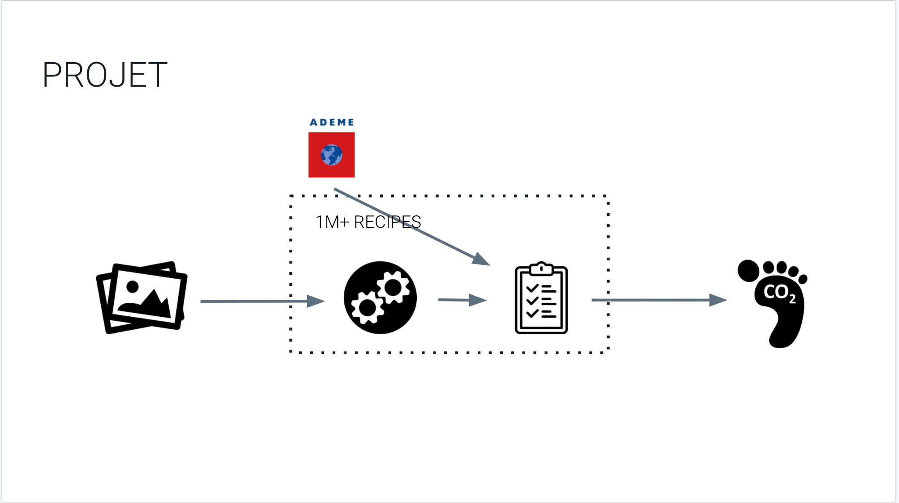

# What is Your Meal Carbon Footprint ?

> "When it comes to tackling climate change, the focus tends to be on ‘clean energy’ solutions – the deployment of renewable or nuclear energy; improvements in energy efficiency; or transition to low-carbon transport. Indeed, energy, whether in the form of electricity, heat, transport or industrial processes, account for the majority – 76% – of greenhouse gas (GHG) emissions.
> 
> But the global food system, which encompasses production, and post-farm process such as processing, and distribution is also a key contributor to emissions. And it’s a problem for which we don’t yet have viable technological solutions".
>
> [Food production is responsible for one-quarter of the world’s greenhouse gas emissions,  *Hannah Ritchie*](https://ourworldindata.org/food-ghg-emissions)

The project aims at estimating meal's carbon footprint based on pictures. The end goal is to provide users with

1. An approximation of their meal's carbon footprint from an uploaded picture 

2. Get low carbon recipe suggestions based on user preferences
    
    
By doing so our goal is to raise consumer awareness on their individual footprints and could  help inform larger businesses (e.g. restaurants, food suppliers etc.).

# References

The project builds upon the 1M+ recipe dataset and existing estimates of CO2 emissions of ingredients.

- [Recipe1M+: A Dataset for Learning Cross-Modal Embeddings for Cooking Recipes and Food Images](http://pic2recipe.csail.mit.edu/), [repository](https://github.com/torralba-lab/im2recipe#recipe1m-dataset)

- Facebook Research inverse cooking : [Inverse Cooking: Recipe Generation from Food Images](https://arxiv.org/abs/1812.06164), [Facebook Research inverse cooking repository](https://github.com/facebookresearch/inversecooking)

- [SmartMeat](https://github.com/SmartMeat-UnB/smartmeat-api)

- [Deep Learning food image recognition system for cooking recipe retrieval](https://github.com/Murgio/Food-Recipe-CNN)
